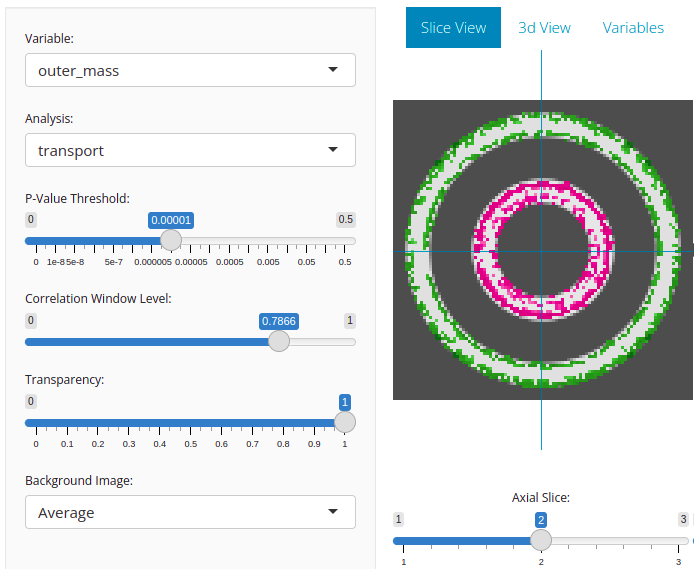
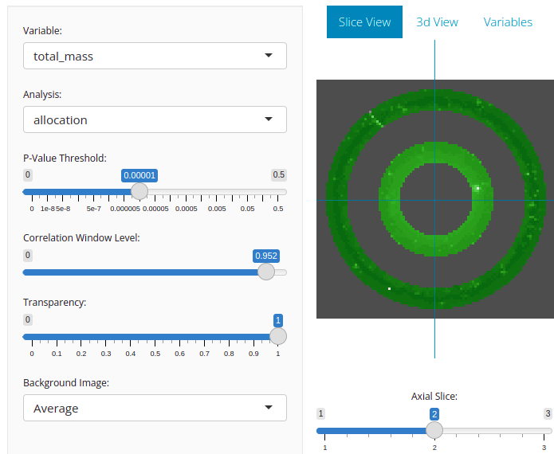

# What this is

The example code in this directory generates a synthetic dataset on which to test the optimal transport morphometry (OTM) pipeline.
The cleaned up scripts to look at are `run3.sh` and `setup.discs3.R`.
The script `run3.sh` first uses `setup.discs3.R` to generate the synthetic dataset, and then it runs the OTM analysis code on that dataset.

# Running the code

To use these scripts, first install the needed dependencies for running the OTM pipeline.
Installation instructions are in the main README of this repository.
Then
```sh
bash run3.sh
```
should be sufficient to run the analysis. Results can then be visualized using the shiny app:
```sh
cd Results3
Rscript app.R
```

# Expected results

The script `run3.sh` will generate a dataset consisting of 40 images of two concentric annuli.
In each image, the outer annulus and the inner annulus will have some randomly chosen mass.
The default behavior is to keep the total mass constant from image to image, but
to allow that mass to vary in its distribution between the outer vs inner annulus.
After computing optimal transport features, this should produce transport cost images
that detect the trade-off in mass that occurs between the inner and outer annulus.
Here is an example where we are correlating the transport cost feature with the mass of the outer annulus:



Of course the exact correlation images will vary with each run due to the stochasticity of the image generation process.
Generating more images by increasing `n` [here](https://github.com/KitwareMedical/UTM/blob/main/Example/Annulus/setup.discs3.R#L14)
will take longer to run but produce cleaner looking results.

If the feature being correlated is changed to "allocation" instead of "transport," then we should see nothing in the correlation image.
This is because no allocation is needed to achieve global mass balancing when the total masses are always the same.
Commenting out [this line](https://github.com/KitwareMedical/UTM/blob/main/Example/Annulus/setup.discs3.R#L50)
changes image generation so that the total mass is allowed to vary, with the masses of the inner and outer annuli varying independently.
Then we can see a correlation of total mass to the allocation feature image:



In this case, the transport cost image should show nothing.

Finally, there is a variable in the dropdown menu called `independent_measure`.
This is a randomly generated number for each image, totally independent of any features of the image.
This variable is here to help check that our multiple comparisons correction is working; i.e. we are not generating too many false positives.
Correlation images of optimal transport features with `independent_measure` should show nothing when the p-value slider is set appropriately.

## The p-value slider

Note that the p-value threshold slider in the screenshots is chosen to be `0.00001`.
This is chosen to be so small small in order to do multiple test correciton; it is a way of choosing p-value at each individual voxel so that the whole correlation image shows Bonferroni corrected p being less than 0.05.
There are 3440 pixels in the annuli, so there are 3440 statistical tests being done here.
Hence in order to get Bonferroni corrected p to be less than 0.05, we need to set the p threshold at each individual voxel to be
`0.05 / 3440 = 0.000014535`. Setting the slider to `0.00001` is close enough.
This correction is extremely conservative, because the 3440 tests have spatial correlation and are not at all independent tests.

