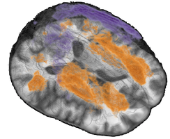
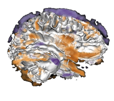

# VolPA - Volumetric Population Analysis



This is a repository that contains scripts to run volumetric population analysis
on brain image data sets.  For a general introduction see 
[Brain morphometry](https://en.wikipedia.org/wiki/Brain_morphometry).

The analysis pipeline contains an optimal transport feature extraction step and can 
perform VBM and TBM with and without optimal transport features. The scripts 
perform preprocessing, feature extraction, analysis and visualization. 

The scripts perform feature extraction using:
- Standard and modified VBM approaches 
  ([VBM](https://en.wikipedia.org/wiki/Voxel-based_morphometry))
- A novel approach based on optimal transport 
  ([UTM](https://www.ncbi.nlm.nih.gov/pmc/articles/PMC6547365/)) that aims to mitigate some concerns with VBM/TBM.

For both approaches different statistical analysis are available:

- **Voxel based correlation analysis**: Correlation of individual voxels<br/>
  [Example result visualization](https://sg-kitware.shinyapps.io/OASIS-1-GM/)
- **Component based analysis**<br/>
  [Example result visualization](https://sg-kitware.shinyapps.io/OASIS-1-GM-Components/)
  - PCA: Principal component based statistical models
  - SpatCA: Spatially regularized component based statistical models 
    ([SpatCA](https://link.springer.com/chapter/10.1007/978-3-030-59728-3_65))
- **Parcellation based analysis**<br/>
  [Example result visualization](https://sg-kitware.shinyapps.io/OASIS-1-GM-Parcels/)

The component and parcel based analysis visualization provide several options
for statistical models and custom statistical models can be incorporated
through R scripting within the shiny user interface.

Depending on the feature extraction (with or without optimal transport
features) the results have slightly different interpretations.

If you are interested in using only the optimal transport feature extraction
step in your own analysis pipeline have a look at the R package
[OTFeatures](https://github.com/samuelgerber/OTFeatures).


## References 
The analysis approach is based on the work in:
> Gerber S, Niethammer M, Styner M, Aylward S. 
> Exploratory Population Analysis with Unbalanced Optimal Transport. 
> Med Image Comput Comput Assist Interv. 2018  
> [Pubmed Link](https://pubmed.ncbi.nlm.nih.gov/31172134/)

A journal article with improvements and additions to the method is in progress.

The spatial component analysis approach is described in:
> Gerber, Samuel, and Marc Niethammer.  
> Spatial Component Analysis to Mitigate Multiple Testing in Voxel-Based Analysis.  
> International Conference on Medical Image Computing and Computer-Assisted Intervention 2020  
> [Link](https://link.springer.com/chapter/10.1007/978-3-030-59728-3_65)

This paper also describes the statistical model employed in the parcel and component based analysis.


## Running the UTM analysis:

There are three stages to running the scripts:
1. Preprocessing
   - See python folder
2. UTM analysis on extracted data
   - See Scripts folder
3. Visualization of results
   - See Scripts/Shiny

For a more detailed description see the documentation in [doc folder](doc).


### Examples

To run the examples install the [requirements](#install) first 

#### Small Image Exaple Data Set
For a self contained example see  
[run-example.py](python/run-example.py)  
The example processes a set of images, saves pre-processed images 
and passes the pre-processed images to the analysis script.
To run in shell in the [python](./python) folder run:
```
python3 run-example.py
```

#### Toy Example Data Set
For a toy example see [Example/Annulus](Example/Annulus)
To run in a shell in the  [Example/Annulus](Example/Annulus) folder:
```
source run.sh
cd Results
Rscript app.R
```

#### OASIS-1 Data Set

For an example on the [OASIS-1 data set](https://www.oasis-brains.org/)  
[run-oasis-1.py](python/run-oasis-1.py)
To run in shell in the [python](./python) folder run:
```
mkdir OASIS-1
cd OASIS-1
python3 ../download-oasis-1.py
cd ..
mkdir OASIS-1-Results
python3 run-oasis-1.py --input_folder ./OASIS-1 --input_cs ./OASIS-1/oasis_cross-sectional.csv --output_folder ./OASIS-1-Results
```

## Visualization of the Results
The results are visualzed with [Shiny](https://shiny.rstudio.com/) applications in the folders
 - [Shiny](./Scripts/Shiny/app.R)
 - [ShinyParcels](./Scripts/ShinyParcels/app.R)
 - [ShinyComponents](./Scripts/ShinyComponents/app.R)
Each folder contains a *upload.to.shinyapps.R* for bundling of relevant files from the output of the main script.

## Install
Requirements to Run Scripts

### Preprocessing
- python 3
- packages
  - antspy (make sure to install from source, the wheel is broken)
  - pandas
  - argparse
  - numpy
  - nibabel
  - dipy

### Analysis
- R >= 3.6
- R packages dependencies: x11, gl/glu, libpng, curl, git dev libraries
  - These need to be installed before the R packages are installed (use package manager of choice for your system)

Once these dependencies are installed several packages are required. For installing all packages use:
```R
install.packages("devtools")
library(devtools)
Sys.setenv("R_REMOTES_NO_ERRORS_FROM_WARNINGS" = "true")
devtools::install_github("samuelgerber/utmR")
```
Or use the [install-all.sh](./Scripts/Packages) shell script.

This will install:
- R packages (Packages folder contains a script to install all):
  - [mop](https://github.com/samuelgerber/mop)
  - [gmra](https://github.com/samuelgerber/gmra)
  - [msr](https://github.com/samuelgerber/msr)
  - [vtkwidgets](https://github.com/samuelgerber/vtkwidgets)
  - data.table
  - lmvar
  - mmand
  - Rtsne
  - stringr
  - glmnet
  - foreach
  - doParallel
  - RColorBrewer
  - optparse
  - pracma
  - yaml
  - ANTsR (requires devtools which depends on curl and git development libraries)
  - shiny
  - shinyBS
  - shinythemes
  - stringr
  - markdown
  - broom
  - corrplot
  - shinyWidgets
  - DT


# Older Analysis Results
Analysis result with an older prototype application.

## OASIS-1 data set
Data Set: https://www.oasis-brains.org/#oasis1

VBM and UTM (different levels of local and global) analysis of 
mini mental score, clinical dementia rating, age:
- White matter: https://sg-kitware.shinyapps.io/OASIS1-WhiteMatter
- Gray Matter: https://sg-kitware.shinyapps.io/OASIS1-GrayMatter
- CSF: https://sg-kitware.shinyapps.io/OASIS1-CSF

## IBIS data set
Data set: IBIS for study of Autsim development

VBM and UTM analysis of different groups 
(HRASD - High risk autisum, LRpos - Low risk positive, LRneg - Low risk negative)
- White Matter: https://sg-kitware.shinyapps.io/IBIS-Normalized-WhiteMatter
- Gray Matter: https://sg-kitware.shinyapps.io/IBIS-Normalized-GrayMatter
- CSF: https://sg-kitware.shinyapps.io/IBIS-Normalized-CSF

## OASIS-3 - data set
Data Set: https://www.oasis-brains.org/#oasis1

VBM and UTM:
- White Matter VBM only: https://sg-kitware.shinyapps.io/OASIS-3-WM
- White Matter: https://sg-kitware.shinyapps.io/OASIS3-WhiteMatter

[Spatial component based analysis](https://link.springer.com/chapter/10.1007/978-3-030-59728-3_65)
- https://sg-kitware.shinyapps.io/OASIS-3-WM-Components


