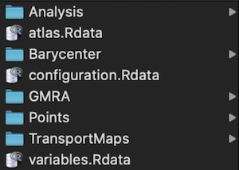
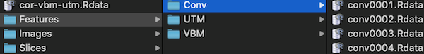

# UTM - Population Analysis Processing

## Overview

The UTM pipeline is an image population analysis software that analyses a set of brain images.
The goal of the analysis is to extract volumetric changes correlated with clinical
or demographic or any variables associated with each image.

The pipeline consist of several steps that determine the interpretation of the end results:
1. Preprocessing:
   -  Align images to common coordinate system
   -  Registration
2. Feature extraction 1:
   -  Determine the semantics of an individual voxel
   -  Segmentations
   -  Intensity adjustments
   -  Processing and extraction of voxel intensities based on additional modalities
3. Feature extraction 2:
   - Determine the semantics of the statistical analysis. The following features are available:
      -  Identity (standard vbm): Analysis concerns differences per voxel. The feature extraction from step 1 is passed through.
      -  Two approaches to compute optimal transport features.
         -  (UTM) Multiscale approach: Analysis concerns difference at a voxel accounting for global or local volume differences. The feature extraction from step is processed to determine where volume has to be allocated or removed to respect global or local volume imbalances.
         - (Conv) Convolutional optimal transport: Analysis concerns difference at a voxel accounting for global or local volume differences. The feature extraction from step is processed to determine where volume has to be allocated or removed to respect global or local volume imbalances.
4. Statistical Analysis
   The following analyses are available (and run per feature extracted above).
   -  Voxel based. Correlations at each voxel
   -  Component based
      -  Principal components analysis
      -  Spatially regularized component analysis
   - Parcel based. Analysis per parcel.
5. Visualization
   - Voxel based ([Example](https://sg-kitware.shinyapps.io/Ances-HAND-GM)) 
     Displays correlation of features images to variables at each voxel
   - Component based ([Example](https://sg-kitware.shinyapps.io/Ances-HAND-GM-Components)) 
     Displays statistical models on projection of feature images to components.
     Interactive selection of statistical models.Currently supported:
     - Correlation
     - Joint linear model
     - Elastic net
     - Liner model per parcel
     - User defined through primitive scripting
   - Parcel based ([Example](https://sg-kitware.shinyapps.io/Ances-HAND-GM-Parcels)) 
     Displays statistical models on “projection” of feature images to parcels (sum of voxel intensities per parcel) .
     Interactive selection of statistical models. Currently supported:
     - Correlation
     - Joint linear model
     - Elastic net
     - Liner model per parcel
     - User defined through primitive scripting

## Preprocessing
Python based.

### Ants registration and segmentation:
[File: standard_ants.py](../python/preprocessing/standard_ants.py)

Inputs:
  - image image to register
  - atlas atlas template to register to
  - atlas_csf atlas csf segmentation
  - atlas_grey atlas grey matter segmentation
  - atlas_white atlas white matter segmentation

Outputs:
 - out_image filename registered image
 - out_tx filename prefix for transformation files
 - out_jac_imaged  filename for jacobian image
  - out_segmentation filename for segmentation

The Jacobian image is needed to account for volume changes of the transformation if desired.
The transformation files are needed if additional modalities need to be registered to the atlas.

## Feature Extraction Step 1

### Ants feature extraction:
[File: create_feature_input.py](../python/preprocessing/create_feature_input.py)

Inputs:
  - segmentation_image
  - segmentation_id extract features only for voxel with passed segmentation IDs
  - intensity_image image to extract intensities from
  - downsample factor to downsample output image

Outputs:
 - out_image filename of output image

For an example to account for jacobian changes see:
[run-example.py](../python/run-example.py)

For an example to process additional modalities:
[run-ances.py](../python/run-ances.py)

### Ants DWI feature extraction
To be done.

Currently used in run-ances.R.

Should be moved into a separate script that can be run on each image and be used as default if DWI images are supplied.

## Feature Extraction Step 2 And Analysis
R scripts.

### Main script
[File: run.utm.barycenter.R](../Scripts/run.utm.barycenter.R)
Runs complete analysis pipeline One large R script that calls a number of smaller scripts.
The script is set up such that individual steps can be run without re-running computationally demanding tasks if possible.
In particular the optimal transport computation only needs to be run if there are new images to be processed. For example;
If there are new variables but no new images required only the Analysis scripts need to be run.

Inputs (positional args):
  - Image-Folder: Folder containing images to analyze, i.e. a set of outputs from feature extraction step 1.
  -  Variables-CSV-File: Variables to analyse CSV file with header row and one column with name containing the image names Remaining columns variables with a numeric entry for each image of variables to analyze.

Many optional arguments (see [default_configuration.yaml](../Scripts/default_configuration.yaml)):
  - atlas: The atlas to use for the parcel based analysis. This is an Rdata file. For an example see Atlas/sri24/labels/atlas.Rdata. This should match the atlas used for the Preprocessing. The default is ./atlas.Rdata.
  - Configuration of optimal transport computation
  - Configuration which feature extraction of steps 2 to run. Default is all create all features from step 2. To not create an feature output add flag (--process.utm.features, --process.vbm.features --process.conv.features)
  - Configuration analysis steps. Again default is all, flags to turn off (--process.correlations, --process-components, --process.parcels)
  - Configurations for individual algorithms. Will be documented in individual scripts.
  - Configurations to set up output folder structure and filenames
Output:
A folder structure with various intermediate and final inputs.
Many intermediate steps are saved to avoid having to recompute when analysing additional variables or adding new images.

The default output looks like: 

- Analysis folder contains analysis results 
  
   - Features contain features extraction step 2 data for each type extracted. Files are in Rdata format one for each input image.
- Barycenter stores barycenter data in Rdata format and gmra file that is a multiscale representation used of the optimal transport computation
- configuration.Rdata stores configuration of the analysis script run.
- GMRA stores multiscale point representation from the point cloud representation
- Points stores the point cloud extract from the feature images in step 2
- Transport Maps stores the transport maps (UTM approach, the convolutional approach is fast and does not store intermediate results) for each feature image to the barycenter image.
- variables.Rdata is the input csv in Rdata file format. Currently a bit of a messy formatting.

For complete list of  inputs see [default_configuration.yaml](../Scripts/default_configuration.yaml).

## Feature Extraction Step 2

### Setup
Extract point clouds from images and compute the euclidean barycenter.

[File: setup.R](../Scripts/Processing/setup.R)

Inputs / Outputs (positional arguments in order):
- images.path: path to a folder with a set of images
- var.table: path to a csv file with one column name for each image in images.path
- var.file: path to store above variables in R format for the subsequent scripts
- points.file.path: Path to a folder to store point clouds extract from images
- Barycenter.euclidean.file: path to store R file containing barycenters

### Create Multiscale Pointset
Extract multi scale representation of pointset representation. Required for optimal transport computation (UTM analysis).

[File: create.gmra.R](../Scripts/Processing/create.gmra.R)

### UTM Barycenter
Optional computation of an optimal transport barycenter. (UTM will use the euclidean barycenter if the optimal transport one is not available)

[File: run.utm.barycenter.R](../Scripts/run.utm.barycenter.R)

### Optimal Transport Computation
Compute optimal transport maps between input feature images and barycenter.

[File: mean.transport.unscaled.R](../Scripta/Processing/mean.transport.unscaled.R)

### Process VBM Features

Extract intensity features from feature images. Basically and identity operation.

[File: vbm.transport.R](../Scripts/Processing/vbm.transport.R)

### Process UTM Features
Extract allocation and transport feature images from optimal transport maps

[File: create.utm.features.R](../Processing/create.utm.features.R)

### Process Convolutional Features
Compute a fast approximate version of a localized unbalanced optimal transport (much faster than the UTM features) and extract allocation feature images.

[File: conv.transport.R](../Processing/conv.transport.R)

## Analysis Steps

### Voxel Based Analysis
[File: analyse.images.correlations.R](../Scripts/Analysis/analyse.images.correlations.R)

### Component Based Analysis
[File: analyse.images.components.R](../Analysis/analyse.images.components.R)

### Parcel Based Analysis
[File: analyse.images.parcels.R](../Analysis/analyse.images.parcels.R)

## Visualization
The resulst are visualzed with [Shiny](https://shiny.rstudio.com/) applications in the folders
 - [Shiny](../Scripts/Shiny/app.R)
 - [ShinyParcels](../Scripts/ShinyParcels/app.R)
 - [ShinyComponents](../Scripts/ShinyComponents/app.R)
Each folder contains a *upload.to.shinyapps.R* for bundling of relevant files from the output of the main script.

The *upload.shiny.input.R* needs to be pointed to the result folder from the run.utm.barycenter.R script.
If not default folder names where used they need to be adjusted by the arguments to teh script to match
the arguments supplied to the *run.utm.barycenter.R*

The Shiny apps interact with [vtk.js](https://kitware.github.io/vtk-js/index.html) rendering
that is scripted in [render.js](../Scripts/ShinyVtkScript/redner.js). The script is interacting
with the Shiny apps thourgh [vtkwidgets](https://github.com/samuelgerber/vtkwidgets).
The change the script or pass aditional data see [vtkwidgets](https://github.com/samuelgerber/vtkwidgets)
inspect the *app.R* and *render.js* code to make sure the data is passed correctly.

# Data Inputs

## User provided input data:
- Set of imaging session with each session
   - (req.) Anatomical Image (T1 or T2)
   - (opt.) Additional Modality Images
- Clinical information associated to each imaging session (csv file)
- (opt) Atlas template (T1 or T2)  with white/gray/CSF segmentations
   - (opt.) Parcellations

## System data:
- Default atlas (T1 and T2) with white/grayCSF segmentations and parcellation.
Default atlas currently sri24 see [Atlas](../Atlas).

